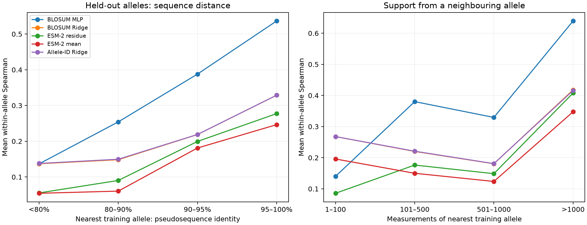
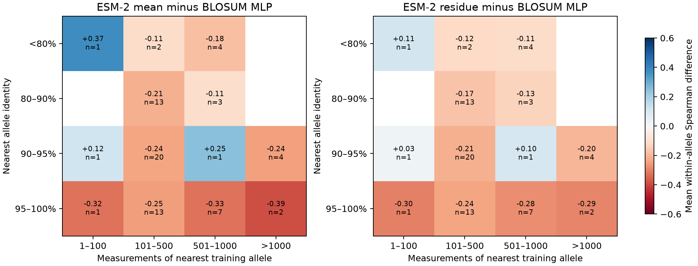
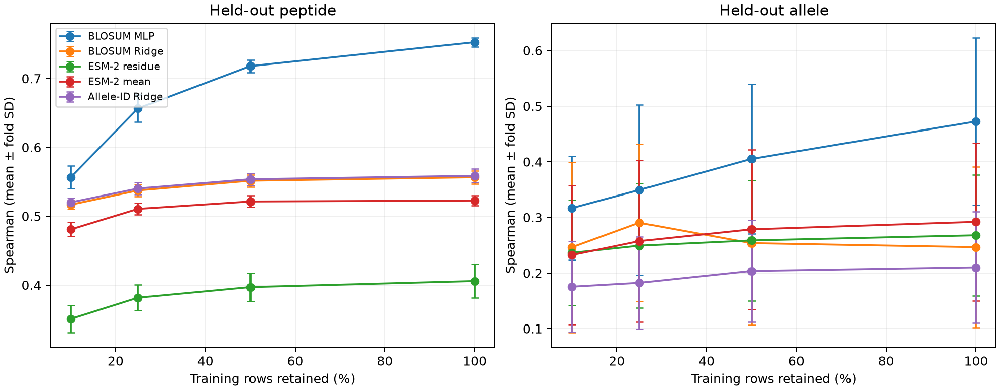

# When does protein pretraining help peptide–HLA stability prediction?

This repository tests whether general pretrained protein representations improve peptide–HLA stability prediction over a supervised model trained on the same sequences, and records the compute needed. The organiser's Rasmussen dataset is the headline study. The earlier IEDB active-learning experiment remains under `scripts/`, `results/policy_comparison/`, and `reports/al_comparison.md`.

H1: pretraining supplies prior structure, so its advantage should increase with the generalization distance demanded by evaluation. This is a hypothesis, not a guarantee or an information-theoretic result.

- P1: little or no advantage on data-rich held-out peptides.
- P2: an advantage on held-out HLA alleles.
- P3: the advantage shrinks monotonically as training data increases.
- P4: extraction method matters more than model choice. Only the extraction comparison is tested here; no second pLM is run.

## Reproduce

Python 3.11 was used. From the repository root:

```sh
python -m venv .venv
source .venv/bin/activate
pip install -r requirements.txt
python -m src.run_benchmark
python -m src.report
python app.py
```

The default benchmark automatically extracts missing ESM-2 representations on Modal, requiring network access, an authenticated Modal account and GPU billing. Set up a new machine with `modal setup` first. Extraction uses an L4 and general checkpoint `facebook/esm2_t33_650M_UR50D`; no stability-trained checkpoint is loaded. Public model downloads need no Hugging Face secret. Cached extraction is reused only after provenance and shape checks.

The data layer verifies `data/external/rasmussen_et_al_dataset.csv` when available; otherwise it reads the committed, checksummed `data/processed/rasmussen_all.csv`. The 8.8 GB IEDB raw export and SPEARMINT source files are unnecessary for the new benchmark. All results CSVs and processed tabular derivatives are versioned. Large `.npy` feature caches and local fitted models are excluded.

Run the baselines without Modal:

```sh
python -m src.run_benchmark --arms blosum_nn blosum_ridge onehot_ridge
```

Run learning curves and checks:

```sh
python -m src.run_benchmark --fractions .1 .25 .5 1
python -m src.report
python -m pytest -q
python -m scripts.check_demo   # while app.py serves localhost:7860
```

Saved jobs resume automatically. Delete or move `results/benchmark/jobs/` and `results/models/` in a disposable checkout to refit completed experiments. After a fresh clone, model files are absent, so full-budget jobs are refit automatically for the demo. Preserve the locked design and split files. To run a different design, use a separate experiment directory/check-out rather than mixing old and new jobs.

## Design

28,166 original pairs; 1,135 engineered C67S rows excluded; 27,031 main-analysis pairs across 72 allele labels. All peptides are 9-mers. All 4,711 main-analysis zeros remain. Targets are `log1p(hours)`. Five peptide-group folds and five allele-group folds are persisted before fitting, with seed 0. Every allele is held out once in the allele regime. All learned preprocessing sees outer training rows only.

The challenge baseline is a 256/64 ReLU MLP trained on BLOSUM62-encoded peptide and 34-contact-residue HLA pseudosequence. Early stopping uses training-only grouped validation. The matched representation comparisons use one fixed head: StandardScaler → randomized PCA (up to 256 components) → RidgeCV. PCA, scaling, and alpha selection are fitted within outer training folds. Ridge alpha selection uses training-only LOO; its internal transforms are not refitted per LOO sample. The outer test folds remain untouched by preprocessing.

Arm A concatenates separately mean-pooled peptide and HLA embeddings. Arm B concatenates the nine peptide-position hidden states from `peptide + GGGG + pseudosequence`. Both use frozen ESM-2. This synthetic sequence permits attention across inputs but is not a validated peptide–HLA structural complex. The BLOSUM and allele-ID Ridge arms use the same PCA/head rule. The MLP is an additional nonlinear baseline, not the matched-head representation comparator.

Primary metric: Spearman. Mean within-allele Spearman is also reported because the use case ranks peptides for an allele. Other metrics: log-scale RMSE, Pearson, and AUC at 2 h and 6 h. Fold SD describes variation across these five folds, not an independent confidence interval. Learning curves use nested seeded row subsets within each outer training fold.

## Results

| Arm | Held-out peptide ρ | Held-out allele ρ |
|---|---:|---:|
| BLOSUM MLP | 0.753 ± 0.007 | 0.473 ± 0.151 |
| BLOSUM Ridge | 0.556 ± 0.010 | 0.246 ± 0.145 |
| ESM-2 residue | 0.406 ± 0.024 | 0.268 ± 0.109 |
| ESM-2 mean | 0.523 ± 0.008 | 0.292 ± 0.142 |
| Allele-ID Ridge | 0.559 ± 0.010 | 0.210 ± 0.100 |

See [the result table](reports/benchmark_table.md), [findings and limitations](reports/benchmark_findings.md), and [implementation scope](reports/implementation_status.md). Raw predictions and metrics are in `results/benchmark/per_row.csv` and `per_fold.csv`.






## Demo

`python app.py` serves <http://127.0.0.1:7860>. It compares arm predictions, the stability tier, spread across five fitted models, allele measurement counts, the nearest better-measured allele, and audited SPEARMINT split overlap. Two examples cover a well-measured and an under-measured allele. Known pairs use the prediction from the fold that excluded their peptide. Their spread across all folds can include models trained on that pair and is explicitly a sensitivity diagnostic, not calibrated uncertainty. Novel peptides load ESM-2 locally on first use, requiring internet/model download and enough memory; known pairs use the saved feature cache.

## Limitations

Zeros may be left-censored but are modelled as exact recorded zeros. C67S constructs are excluded. Only 9-mer, class-I pairs are covered. Exact peptide grouping does not eliminate near-sequence similarity; the allele split permits shared peptides across different alleles. Small alleles give noisy correlations and some constant-label groups yield undefined correlations, which are excluded from macro averages. These are retrospective comparisons with no laboratory or clinical claim.

Only one common Ridge-head/PCA specification is used for representation comparisons; the separate MLP can learn interactions that additive Ridge inputs cannot. A 34-residue contact pseudosequence and a synthetic linker may be out of distribution for ESM-2. No groove-domain, second-pLM, zero-shot, or structure arm has been run. ESM-2 pretraining sequence overlap is unknown; supervised stability-data overlap is avoided by using a general checkpoint. The same five evaluation folds support the report, so later architecture selection would need new evaluation. The original IEDB final-test partition has not been evaluated.

The frozen historical study found random acquisition better than both pure-diversity policies. Geometry measurements motivate a possible explanation but do not establish a causal mechanism. Legacy vectorizers now fit acquisition-pool inputs only; historical CSVs retain their original run provenance.

Implementation references: [scikit-learn GroupKFold](https://scikit-learn.org/stable/modules/generated/sklearn.model_selection.GroupKFold.html), [Modal GPU functions](https://modal.com/docs/guide/gpu). Dataset provenance and checksums are in `data/manifests/rasmussen_manifest.json`.
