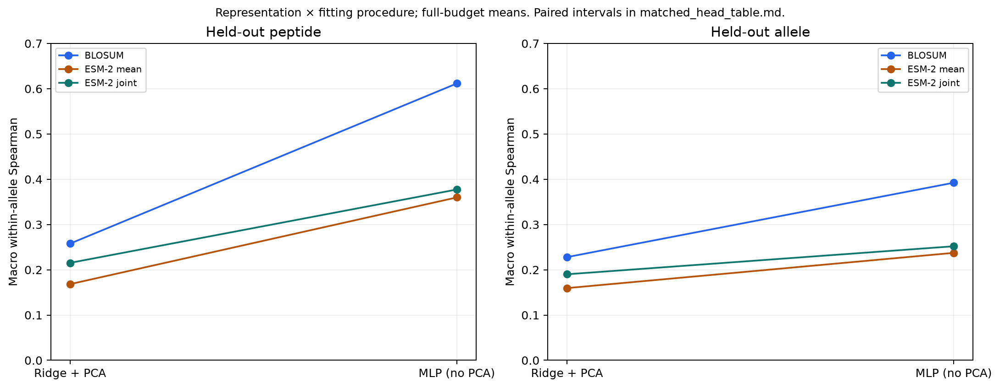
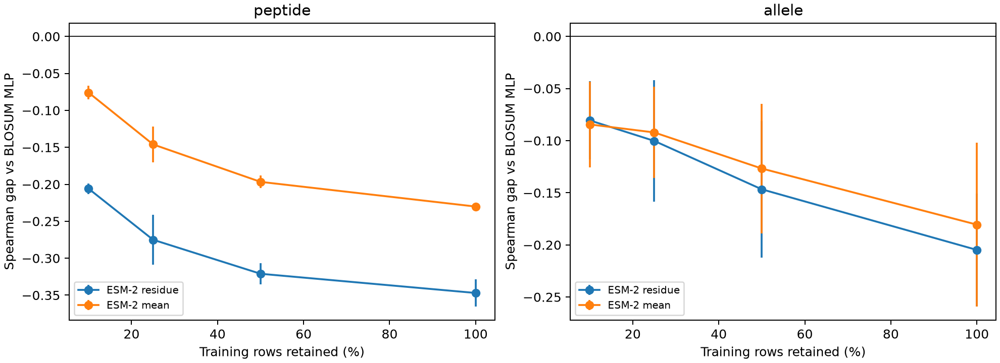
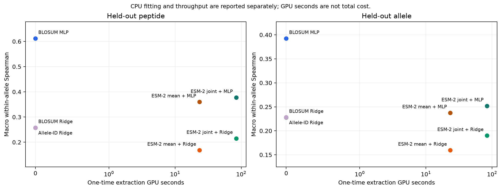
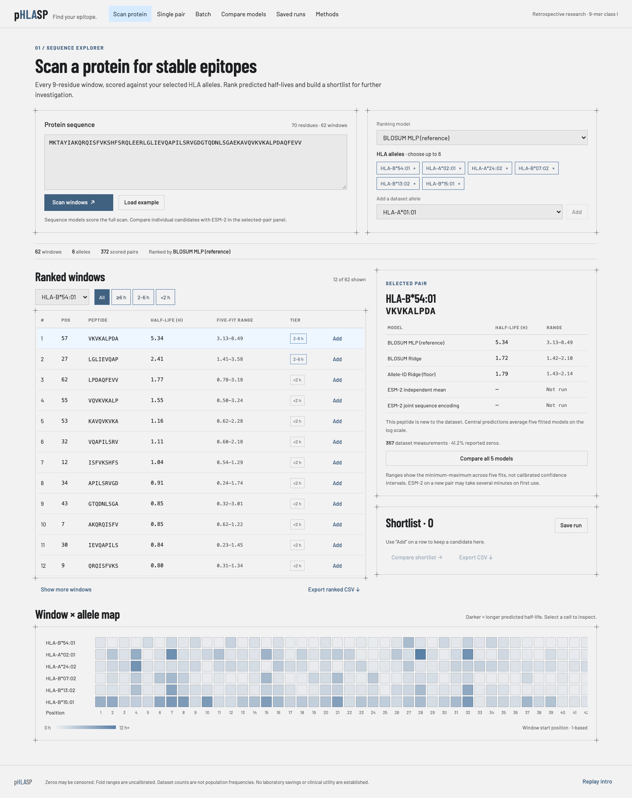

# pHLASP — Peptide–HLA Stability Predictor

**Find your epitope.** A reproducible research benchmark and local web workspace for predicting peptide–HLA complex stability, scanning proteins for candidate 9-mers, and comparing sequence baselines with frozen protein language model representations.

**Current finding:** prediction depends strongly on both the representation and the downstream fitting procedure. Adding the same 256/64 MLP procedure improves both ESM-2 representations on held-out peptides, but BLOSUM + MLP still leads in both primary regimes. The earlier ESM-2 + Ridge versus BLOSUM + MLP comparison mixed these two factors; the follow-up narrows that gap without reversing the main ranking.

This repository contains the prepared data, locked splits, predictions, statistical comparisons, compute measurements, figures, a working website with its opening animation, and an earlier active-learning study. The website uses real fitted models.

## Research question

> Under what conditions, if any, do general protein foundation model representations improve peptide–HLA stability prediction over sequence-aware supervised models trained on the same sequences, and what does that cost in compute?

A **peptide** is a short amino-acid sequence; an **HLA allele** identifies a variant of the protein that displays it. Here the prediction target is the measured dissociation **half-life in hours** of a peptide–HLA complex: how long it remains stable under the assay conditions. This is different from binding affinity or an immune response. The app helps explore candidate stability; a high prediction does not establish that a peptide will be an effective epitope.

**H1 — pretraining supplies an inductive bias.** Both approaches receive the same peptide and HLA sequence information. Once pretrained weights are fixed, a deterministic encoding cannot create additional label information beyond those inputs. Pretraining on large-scale protein sequence corpora may nevertheless help a predictor learn from limited labels. Greater benefit under label scarcity or greater sequence distance is a hypothesis, not a mathematical consequence of that observation.

| Prediction | What we tested | What we found |
|---|---|---|
| **P1:** little or no pLM advantage on data-rich held-out peptides | Five peptide-group folds at full label budget | Consistent with P1: both ESM-2 representations lose under either tested fitting procedure. |
| **P2:** an advantage on unseen alleles, increasing with distance from training alleles | Five allele-group folds, distance strata, and whole-locus holdouts | No demonstrated advantage with matched MLP procedures in the primary allele regime. Locus results are appendix-only exploratory checks. |
| **P3:** the pLM-minus-baseline gap decreases as the label budget grows | Nested 10%, 25%, 50%, and 100% training budgets | Original Ridge-headed pLM gaps decrease across the grid but start negative. Matched-MLP label-budget curves have not been run. |
| **P4:** extraction matters more than model choice | Independent mean pooling versus joint sequence encoding using the same ESM-2 checkpoint | Extraction effects depend on the head; Ridge and MLP contrasts are now reported. A second pLM remains unrun. |

See the [full findings and hypothesis assessments](reports/benchmark_findings.md).

## What is implemented

| Component | Current state | Evidence / entry point |
|---|---|---|
| Data preparation | Checksummed main dataset with zero labels retained, engineered constructs excluded, and per-allele audits | [Data manifest](data/manifests/rasmussen_manifest.json), [data loader](src/data.py) |
| Benchmark | Seven approaches, four regimes; 215 original jobs plus 26 full-budget matched-MLP fits | [Locked design](results/benchmark/design.json), [runner](src/run_benchmark.py) |
| Analysis | Macro and pooled metrics, paired confidence intervals, distance/support analysis, strict control, tier AUC, compute accounting | [Findings](reports/benchmark_findings.md), [result table](reports/benchmark_table.md) |
| Website | Protein scanning, single-pair prediction, batch CSV, model comparison, shortlists, saved runs, exports, and methods | [Frontend](web/), [implementation notes](web/README.md) |
| Animation | pHLASP helix/residue intro, moving 9-mer window, Skip/Escape, replay, and reduced-motion behavior | [Intro preview](reports/workspace_intro.png), [checks](results/benchmark/intro_checks.json) |
| Verification | Python tests, clean-clone baseline reproduction, live demo checks, desktop/mobile browser checks | [Validation section](#validation) |
| Earlier study | IEDB source review, predictor pilots, and random versus diversity-based acquisition | [Active-learning report](archive/iedb_pilot/reports/al_comparison.md) |

## Dataset and target

The main benchmark uses the organizer-supplied **Rasmussen dataset**. Provenance, checksums, and the source-sheet URL are recorded in the [manifest](data/manifests/rasmussen_manifest.json).

| Stage | Peptide–HLA pairs | Allele labels | Recorded zeros |
|---|---:|---:|---:|
| Original organizer table | 28,166 | 75 | 5,679 |
| Main benchmark, after excluding engineered C67S constructs | 27,031 | 72 | 4,711 |

The exclusion removes 1,135 rows across three engineered allele labels. All main-set peptides have nine residues. HLA inputs use the **34-residue contact pseudosequence**; the available 182-residue groove sequence is an unrun alternative. The dataset contains HLA-A and HLA-B, with no HLA-C measurements.

The regression target is **`log1p(thalf_hours)`**. Zero measurements remain in the main analysis and per-allele zero fractions are reported. Zeros may represent left-censoring but are currently treated as exact labels. Input checks enforce sequence lengths, required values, and uniqueness of peptide–allele pairs.

The data loader uses the original organizer CSV when present, or the committed checksummed [processed source table](data/processed/rasmussen_all.csv) otherwise. The large raw IEDB export and external SPEARMINT CSVs are not needed for this benchmark or the saved demo exposure audit.

## Models and representations

A **model arm** simply means one approach being compared in the experiment.

| Approach / code name | Input representation | Predictor and role |
|---|---|---|
| **BLOSUM MLP** / `blosum_nn` | Positional BLOSUM62 encoding of the 9-mer and 34-residue HLA pseudosequence: 860 features | 256/64 ReLU neural network; the sequence-aware reference |
| **BLOSUM Ridge** / `blosum_ridge` | The same 860 sequence features | Common Ridge procedure; linear sequence control |
| **Allele-ID Ridge** / `onehot_ridge` | BLOSUM62 peptide features plus training-fitted allele one-hot features | Illustrative floor; an unseen allele has an all-zero allele-ID vector |
| **ESM-2 mean** / `esm2_mean` | Concatenated, separately mean-pooled peptide and HLA hidden states: 2,560 features | Common Ridge procedure on frozen protein representations |
| **ESM-2 joint** / `esm2_joint` | Concatenated hidden states at the nine peptide positions from `peptide + GGGG + pseudosequence`: 11,520 features | Common Ridge procedure on frozen joint sequence encoding |
| **ESM-2 mean + MLP** / `esm2_mean_nn` | Reuses the same 2,560-feature mean cache | Same MLP procedure as BLOSUM; full-budget follow-up |
| **ESM-2 joint + MLP** / `esm2_joint_nn` | Reuses the same 11,520-feature joint cache, without PCA | Same MLP procedure as BLOSUM; full-budget follow-up |

All four ESM-2 approaches use **`facebook/esm2_t33_650M_UR50D`**, with 1,280 hidden dimensions. Joint encoding uses a synthetic sequence; it does not assert that attention models a physical peptide–HLA complex. No SPEARMINT/MINT stability-trained embeddings or NetMHCstabpan predictions are used as benchmark inputs or comparators.

The common Ridge procedure is **StandardScaler → randomized PCA (up to 256 components) → RidgeCV**. Alpha is chosen independently for each approach/fold/budget over 0.01–100,000 using training-only leave-one-out selection. The procedure is shared; the chosen alpha is not forced to be the same. Full-budget ESM-2 selections were 1,000 for mean pooling and 10,000 for joint encoding; sequence controls selected 0.01–100.

Outer test rows are excluded from all preprocessing and fitting. Scaling and PCA are not refitted inside each internal leave-one-out alpha-selection step, which is a limitation of the selection procedure. All three MLP approaches use AdamW and a grouped validation subset of outer training data for early stopping: peptide groups for peptide holdouts, allele groups otherwise. Split seed is 0; model, PCA, inner-validation, and nested-subset seeds equal the outer fold number. Embedding caches validate checkpoint, dimensions, row identity, dataset checksum, and array availability.

## Experimental design

| Regime | Question | Split |
|---|---|---|
| **Peptide** | Can the predictor rank peptides it has not seen? | Five peptide-group folds; all rows for a peptide remain together |
| **Allele** | Can it transfer to an unseen HLA sequence? | Five allele-group folds; cross-allele peptide sharing is allowed |
| **Locus** | Can it transfer across a larger HLA sequence shift? | Train B/test A, and train A/test B |
| **Strict allele** | What happens when shared peptides are also removed? | Allele fold 0, excluding every training peptide present in its test set |

The strict control reduces training from **22,879 to 7,794 rows**, removing 15,085 shared-peptide rows while preserving **4,152 test rows** and 12 macro-eligible alleles. It combines removal of peptide sharing with a large reduction in label budget, so its performance change does not isolate a causal effect of sharing.

Peptide and allele regimes use nested **10%, 25%, 50%, and 100%** training budgets. Locus and strict controls use their full retained training sets. Every held-out allele has **zero same-allele training measurements**; support from a nearest training allele is a separate quantity.

The original v2 analysis contains **215 model/fold/budget jobs**: 200 original fits reused and re-scored, plus 15 new full-budget locus/strict fits. The v2 split and benchmark designs were locked before those new fits. Original peptide/allele splits and 270,310 primary-regime full-budget predictions remain unchanged. Re-scoring earlier results under the revised primary metric is a **retrospective reanalysis**, not independent confirmation. Designs and outputs are retained in [split records](results/splits/) and [benchmark records](results/benchmark/); v1 is preserved under [results/archive](results/archive/) and [reports/archive/v1](reports/archive/v1/).

### Metrics and confidence intervals

The primary endpoint is **macro-averaged within-allele Spearman correlation**: rank peptides within each eligible allele, then weight eligible alleles equally. Eligibility is evaluated separately within each test fold and requires **at least 20 test rows and 10 distinct positive recorded half-lives**. Zero labels remain in the correlation. Constant predictions for an eligible allele make the macro undefined instead of silently dropping that allele. [Eligibility audits](results/benchmark/allele_metric_audit.csv) and [exclusions](results/benchmark/excluded_alleles.csv) include absent alleles with zero test rows.

Pooled Spearman, pooled-minus-macro, Pearson, log-scale RMSE, and tier AUC at 2/6 hours are secondary diagnostics. Pooled-minus-macro is a descriptive aggregation gap, not a causal decomposition of allele offsets. For alleles with at least 50% zeros—HLA-B*41:01, B*45:01, B*51:01, and B*55:01—lead with [tier AUC](results/benchmark/high_zero_summary.csv). Thresholds are compared on the log scale to preserve tier boundaries.

- **Peptide/allele comparisons:** paired 95% t intervals over five fold-level differences. The “±” beside a score is fold standard deviation, not its confidence interval.
- **Locus summary:** a two-fold t interval, which is highly unstable.
- **Per-locus, strict, distance, and support comparisons:** paired-allele bootstrap intervals conditional on the fixed split, using 10,000 resamples and seed 0.

These intervals are nominal and exploratory. Shared training data, related alleles, multiple comparisons, and method selection are not fully captured; bootstrap intervals do not represent repeated independent experiments.

## Results: separate representation from fitting procedure

At full budget, peptide-holdout macro Spearman is **0.612** for BLOSUM + MLP, **0.360** for ESM-2 mean + MLP, and **0.377** for ESM-2 joint + MLP. On allele holdout the corresponding scores are **0.392**, **0.237**, and **0.252**.

Holding the representation fixed, the peptide MLP-minus-Ridge gains are **+0.354 [+0.323, +0.385]** for BLOSUM, **+0.192 [+0.179, +0.204]** for ESM-2 mean, and **+0.162 [+0.124, +0.201]** for ESM-2 joint. With MLP procedures matched, the remaining peptide gaps against BLOSUM are **-0.252 [-0.279, -0.224]** and **-0.234 [-0.251, -0.217]**. These are descriptive paired 95% intervals, not causal shares of an error budget.

Full-budget macro within-allele Spearman; five-fold paired t intervals. These are descriptive contrasts of fitting procedures, not a causal decomposition.

| Representation | Peptide Ridge | Peptide MLP | Allele Ridge | Allele MLP |
|---|---:|---:|---:|---:|
| BLOSUM | 0.258 | 0.612 | 0.228 | 0.392 |
| ESM-2 mean | 0.168 | 0.360 | 0.160 | 0.237 |
| ESM-2 joint | 0.215 | 0.377 | 0.190 | 0.252 |

| Contrast (first minus second) | Peptide Δ [95% CI] | Allele Δ [95% CI] |
|---|---:|---:|
| BLOSUM MLP (reference) − BLOSUM Ridge | +0.354 [+0.323, +0.385] | +0.164 [+0.089, +0.240] |
| ESM-2 mean + MLP − ESM-2 mean + Ridge | +0.192 [+0.179, +0.204] | +0.078 [+0.006, +0.150] |
| ESM-2 joint + MLP − ESM-2 joint + Ridge | +0.162 [+0.124, +0.201] | +0.062 [+0.018, +0.106] |
| ESM-2 mean + Ridge − BLOSUM Ridge | -0.090 [-0.107, -0.072] | -0.068 [-0.096, -0.041] |
| ESM-2 joint + Ridge − BLOSUM Ridge | -0.043 [-0.069, -0.016] | -0.038 [-0.050, -0.026] |
| ESM-2 mean + MLP − BLOSUM MLP (reference) | -0.252 [-0.279, -0.224] | -0.155 [-0.264, -0.046] |
| ESM-2 joint + MLP − BLOSUM MLP (reference) | -0.234 [-0.251, -0.217] | -0.140 [-0.214, -0.066] |
| BLOSUM Ridge − Allele-ID Ridge (floor) | -0.000 [-0.001, +0.001] | -0.000 [-0.001, +0.000] |
| ESM-2 joint + Ridge − ESM-2 mean + Ridge | +0.047 [+0.027, +0.067] | +0.031 [-0.002, +0.063] |
| ESM-2 joint + MLP − ESM-2 mean + MLP | +0.018 [-0.009, +0.044] | +0.015 [-0.046, +0.075] |



### Why a linear HLA block cannot change within-allele ranking

For concatenated independent features, the fitted scaler → PCA → Ridge pipeline remains affine in the original inputs: `prediction(p, a) = w_peptide · x(p) + w_HLA · h(a) + b`. Within one allele, `h(a)` is constant. Its contribution is an offset, which cannot change within-allele Spearman. Thus BLOSUM Ridge, allele-ID Ridge, and independent-mean ESM-2 Ridge cannot express allele-dependent peptide rankings for a fixed fitted model. Their peptide functions differ; they are not all the same predictor.

BLOSUM Ridge minus allele-ID Ridge is **-0.000 [-0.001, +0.001]** on peptide holdout and **-0.000 [-0.001, +0.000]** on allele holdout. Their near agreement is consistent with this structural limitation, but **equality between separately trained models is not a mathematical identity**: joint PCA fitting, regularization selection, and the HLA feature block can change the learned peptide coefficients.

Joint ESM-2 features depend on the peptide and allele together before the linear head; they can express context-dependent rankings. MLP heads can also learn interactions from independently concatenated features. This explains a representational capability, not proof that learned attention represents a physical complex or that the capability necessarily improves transfer.

The MLP procedure is matched, but input dimensions and parameter counts differ. Ridge-versus-MLP also changes PCA, optimization, and regularization, so these are observed contrasts, not a causal decomposition. All new fits are full-budget only.

See [the full findings](reports/benchmark_findings.md), [all seven-approach tables](reports/benchmark_table.md), and the [exploratory locus appendix](reports/locus_appendix.md). The locus result is not a headline claim.



### Post-hoc patience check

A separate **18-fit** study doubled patience from 15 to 30 for BLOSUM and both ESM-2 MLPs on the allele and strict regimes. At patience 30, the allele gaps against BLOSUM are **-0.158 [-0.264, -0.052]** for mean ESM-2 and **-0.136 [-0.218, -0.054]** for joint ESM-2. **5/18** fits still select epoch ≤2; no further patience or validation-split search was performed. This is a post-hoc sensitivity check, not a replacement for the main patience-15 tables, and peptide patience sensitivity remains untested. [Results and per-fold stopping epochs](reports/patience_sensitivity.md).

## Compute cost

Recorded costs from [compute.csv](results/benchmark/compute.csv):

| Approach | One-time extraction GPU-function seconds | Peak allocated GPU memory, GB | CPU fit/predict seconds, all full-budget regimes |
|---|---:|---:|---:|
| BLOSUM MLP | 0 | — | 31.70 |
| BLOSUM Ridge | 0 | — | 9.68 |
| Allele-ID Ridge | 0 | — | 47.06 |
| ESM-2 mean | 23.40 | 1.43 | 28.84 |
| ESM-2 joint | 83.88 | 1.48 | 223.16 |
| ESM-2 mean + MLP | 23.40 (shared cache) | 1.43 | 54.80 |
| ESM-2 joint + MLP | 83.88 (shared cache) | 1.48 | 433.87 |

Mean extraction processes 5,705 deduplicated individual sequences, at approximately 623 sequences/s during inference. Joint extraction processes 27,031 pair sequences, at approximately 338 sequences/s. These workloads and counting units differ. GPU-function timing includes worker model loading but excludes container startup, transfer, and a full billing total. CPU timings cover the full-budget benchmark fits, not website request latency or all label-budget fits. They are measured run timings, not hardware-independent promises.

Both v2 and the matched-MLP follow-up reused existing embeddings and required **no additional GPU extraction**. The new models share the original extraction costs; those rows must not be added as separate extraction runs. GPU seconds are not total financial cost.



## Reproduce the benchmark

Python 3.11 was used. From the repository root:

```sh
python3.11 -m venv .venv
source .venv/bin/activate
pip install -r requirements.txt

# CPU sequence baselines, all four regimes.
python -m src.run_benchmark --arms blosum_nn blosum_ridge onehot_ridge

# Original five approaches and label-budget curves.
# Requires local ESM-2 arrays, or authenticated Modal extraction.
modal setup
python -m src.run_benchmark --arms blosum_nn blosum_ridge onehot_ridge esm2_mean esm2_joint --fractions .1 .25 .5 1

# Matched-MLP follow-up: reuse caches, full budget, one process at a time.
python -m src.run_benchmark --arms esm2_mean_nn --fractions 1.0
python -m src.run_benchmark --arms esm2_joint_nn --fractions 1.0
python -m src.report
python -m scripts.check_mlp_extension

# Optional reproduction of the separate post-hoc patience check (18 fits).
python -m scripts.patience_sensitivity
python -m pytest -q
```

**The ESM-2 feature arrays (`esm2_mean.npy`, `esm2_joint.npy`, and `*_row_ids.npy`) are not committed; only their `_meta.json` sidecars are.** Reproduction requires a local cache or re-extraction through `python -m scripts.modal_benchmark_embed`, with an authenticated Modal account, network access, and GPU billing. The public checkpoint requires no Hugging Face secret. The new MLP approaches refuse to trigger GPU extraction themselves. No new extraction was performed for this follow-up.

Keep the two new approaches in separate invocations on memory-constrained machines. Joint inputs have 11,520 features and require several GB during training; the MLP is not silently replaced by PCA. Saved jobs resume, but missing full-budget model binaries cause refitting. On a fresh clone, create original caches first. `python -m src.report` can regenerate reports from committed prediction/metric CSVs without fitting models.

The original v2 `design.json` stays locked. The 26-fit follow-up is separately locked in [mlp_extension_design.json](results/benchmark/mlp_extension_design.json). Its reduced-budget cells are deliberately unrun. To force refits, move saved jobs/models aside in a disposable checkout, and do not mix incompatible designs. All 215 earlier jobs are byte-preserved; there are now **241 jobs and 596,715 full-budget predictions**. The follow-up was motivated by inspecting v2 results and is not independent confirmation.

### Result files

| File / directory | Contents |
|---|---|
| [per_row.csv](results/benchmark/per_row.csv) | 596,715 full-budget prediction rows across seven models and four regimes |
| [per_fold.csv](results/benchmark/per_fold.csv) | Metrics for **all budgets**; filter `fraction == 1` for full-budget results |
| [per_allele.csv](results/benchmark/per_allele.csv) | Per-allele evaluation metrics |
| [paired_comparisons.csv](results/benchmark/paired_comparisons.csv) | Model-minus-reference differences and paired intervals |
| [distance_stratified.csv](results/benchmark/distance_stratified.csv) | Distance and support stratification |
| [locus_paired_ci.csv](results/benchmark/locus_paired_ci.csv) | Per-locus paired-allele comparisons |
| [strict_vs_permissive.csv](results/benchmark/strict_vs_permissive.csv) | Strict peptide-sharing control |
| [fit_compute.csv](results/benchmark/fit_compute.csv) | Fit metadata, selected hyperparameters, timing, and reuse provenance |
| [jobs/](results/benchmark/jobs/) | Per-fit raw predictions and metadata, including smaller budgets |

## Validation

The current Python suite has **18 passing tests** covering split boundaries, zero handling, macro eligibility and weighting, paired-CI alignment, training-only preprocessing, cache checks, the corrected IEDB audit, input validation, window positions, tier boundaries, agreement with saved predictions, reproduction of a reference fit with the unchanged default patience, and held-out routing of novel allele pairings.

```sh
python -m pytest -q
```

Create the baseline model artifacts before running workspace prediction tests. For full live checks, prepare all five models and keep `python -m notes.website.app` running in a separate terminal:

```sh
python -m scripts.check_demo
pip install -r requirements-dev.txt
python -m playwright install chromium
python scripts/check_workspace.py
python scripts/check_intro.py
```

Recorded verification:

- [Patience sensitivity](results/benchmark/patience_sensitivity/checks.json): 18 fits with matching training/test rows and eligibility; protected main-benchmark outputs remain byte-identical. The [figure check](results/benchmark/patience_sensitivity/figure_checks.json) regenerates seven-model figures in isolation and reproduces the matched-head table.

- [Original v2 validation](results/benchmark/validation.json): 215 jobs and 426,225 predictions before the follow-up. [Matched-MLP acceptance checks](results/benchmark/mlp_extension_checks.json) verify all 26 new fits, 241 total jobs, 596,715 full-budget predictions, matching training hashes/test rows/eligibility, and unchanged original jobs and splits.
- [Clean-clone reproduction](results/benchmark/reproducibility.json): at benchmark commit `805fad9`, a fresh Python 3.11 environment without the original organizer file reproduced all **39 baseline fits / 255,735 predictions with maximum absolute difference 0.0**. Regenerated comparison tables matched exactly; the then-current 12 tests passed. Full ESM-2 extraction was not repeated in that clone. This is a benchmark reproduction check, not a clean-clone verification of subsequent website changes.
- [Live legacy demo](results/benchmark/demo_checks.json): both example inputs return all five approaches.
- [Workspace browser checks](results/benchmark/workspace_checks.json): real 62-window × six-allele scan, filtering, heatmap, pair inspection, shortlists, CSV upload/export, saved-run restoration, five-model predictions, invalid-input feedback, and mobile layout. Passed in isolated headless Chromium with no browser errors.
- [Animation checks](results/benchmark/intro_checks.json): residue/window alignment, tagline timing, automatic exit, replay, Skip/Escape, focus restoration, portrait/landscape layouts, and reduced motion. Passed with no browser errors. Desktop and mobile screenshots are available in the website section below.

## Earlier IEDB active-learning study

The [archived IEDB pilot](archive/iedb_pilot/) retains the initial research question: **can representation-based acquisition choose stability measurements that improve prediction faster than random selection?** That study uses a distinct source-reviewed set of **5,815 positive peptide–HLA pairs across 10 alleles** and its own fixed pool/development/final-test partitions. Its final test remains untouched.

The source review, overlap audit, predictor pilots, and three-policy comparison are complete. Random acquisition beat both sequence-diversity and embedding-diversity acquisition at every tested budget in all 10 seeds. This is a negative result for those pure-diversity policies with that predictor. Feature geometry is a possible explanation, not an established cause; uncertainty-based acquisition has not been tested, so the result does not show that active learning generally fails.

The corrected IEDB comment audit distinguishes the phrase “at least two independent experiments” from bounded outcome measurements. It leaves 6,101 rows without automatic flags, including the 5,815 positive candidates, and six flagged comments. Passing the screen alone does not establish source verification. The subsequent review and its assumptions are documented separately.

Read the [source review](archive/iedb_pilot/reports/source_review.md), [overlap audit](archive/iedb_pilot/reports/overlap_report.json), [pilot findings](archive/iedb_pilot/reports/pilot_findings.md), and [active-learning comparison](archive/iedb_pilot/reports/al_comparison.md). Original scripts, prepared data, and result directories are now under `archive/iedb_pilot/`; these results should not be mixed with the main 27,031-pair benchmark.

## Limitations and work not yet done

- **Data scope:** nine-residue peptides, class I HLA-A/B, one dataset, and a binder-enriched measurement setting. Counts measure dataset coverage, not population representation. Whole-protein scanning has not been independently validated on a new protein distribution.
- **Measurement uncertainty:** the supplied file has no replicate values or duplicate allele–peptide rows, so its assay-noise ceiling cannot be estimated. See the [assay reproducibility review](reports/assay_reproducibility.md) for published context and why it does not provide this benchmark’s ceiling.
- **Generalization:** ordinary allele splits permit peptide sharing; near-sequence similarity is not clustered. The strict control uses one fold and also reduces training size. Only two locus holdouts are available.
- **Model scope:** one frozen pLM, two extraction strategies, a common Ridge/PCA procedure, and the same MLP procedure applied to BLOSUM and both ESM-2 inputs. The pseudosequence and synthetic linker may be out of distribution for the pretrained model.
- **Uncertainty:** benchmark intervals have the dependence and selection limitations stated above. The website has no calibrated per-prediction interval or probability of correctness.
- **Input truncation:** supplied `hla_seq` covers the 182-residue α1/α2 domain, not a full chain or β2-microglobulin. The tested pLM inputs use only the 34 contact residues, so natural-chain context is absent; its impact has not been isolated.
- **Structure-model scope:** a dataset-wide structure comparison needs substantial additional inference and a validated link to half-life. Boltz-2’s documented affinity output targets small molecules and an IC50-like endpoint, not peptide–HLA dissociation stability. See the [full rationale](reports/benchmark_findings.md#input-scope-and-omitted-structure-models); no GPU-day runtime estimate was measured.
- **Unrun extensions:** zero-shot masked likelihood, a second pLM, the 182-residue groove representation, structural analysis, and broader pretraining-contamination analysis. Uncertainty-based active learning also remains unrun.
- **Claims:** no demonstrated laboratory savings, therapeutic efficacy, immunogenicity, clinical benefit, or numerical noise ceiling is claimed.

The [benchmark implementation record](reports/implementation_status.md) documents the benchmark extension and verification; [website notes](web/README.md) cover the later interface and animation.

## Repository map

| Path | Purpose |
|---|---|
| [notes/website/](notes/website/) | Optional website launcher and FastAPI wrapper; run `python -m notes.website.app` |
| [src/](src/) | Main data, representations, models, splits, evaluation, reporting, and website inference/API |
| [web/](web/) | Website HTML, styles, JavaScript, animation, and supplied design-system documentation |
| [scripts/](scripts/) | Benchmark embedding extraction, matched-head acceptance checks, and live/browser verification |
| [archive/iedb_pilot/](archive/iedb_pilot/) | Separate earlier IEDB study: scripts, data, results, and historical reports |
| [notes/](notes/) | User runbooks, handoff notes, and optional website launcher |
| [tests/](tests/) | Benchmark and workspace regression checks |
| [data/processed/](data/processed/) | Prepared tables and locally generated feature caches |
| [data/manifests/](data/manifests/) | Input provenance and checksums |
| [results/benchmark/](results/benchmark/) | Original v2 plus matched-MLP predictions, metrics, fit records, and verification evidence |
| [results/splits/](results/splits/) | Locked evaluation assignments and split design |
| [reports/](reports/) | Scientific findings, plots, audits, website screenshots, and implementation notes |
| [requirements.txt](requirements.txt) / [requirements-dev.txt](requirements-dev.txt) | Pinned runtime dependencies and browser-check dependencies |

## Optional website: setup and features

Python **3.11** was used. From the repository root:

```sh
python3.11 -m venv .venv
source .venv/bin/activate
pip install -r requirements.txt
python -m src.run_benchmark --arms blosum_nn blosum_ridge onehot_ridge
python -m notes.website.app
```

Open **http://127.0.0.1:7860**. The baseline command creates the fitted models needed for CPU-only scanning, batch scoring, and the three sequence-baseline comparisons. Saved fits resume. Model binaries are not committed, so this fitting step is needed on a fresh clone. Use comparisons with ESM-2 disabled until you have run the benchmark setup above.

The frontend is plain HTML/CSS/JavaScript with FastAPI and vectorized Python inference. No Node installation or frontend build is required. The original Gradio interface remains at **http://127.0.0.1:7860/legacy**.

Interactive API documentation is at **http://127.0.0.1:7860/api/docs**. The local API exposes dataset metadata through `GET /api/bootstrap` and scoring through `POST /api/scan`, `/api/predict`, `/api/batch`, and `/api/compare`.

## Website features

The workspace implements the supplied website outline and subsequent animated layout, using the pHLASP branding, steel-blue design, compact panels, and responsive desktop/mobile layouts.

| Workspace page | What it does |
|---|---|
| **Protein scan** | Accepts one protein sequence or single FASTA record, 9–1,000 residues, and one to six of the 72 dataset alleles. Scores every overlapping 9-mer, preserves its 1-based position, and provides rankings, stability-tier filters, and a clickable window × allele heatmap. Identical pairs share inference work. |
| **Single prediction** | Compares a peptide–allele pair across the three sequence baselines and, optionally, both ESM-2 approaches. Shows dataset measurement counts, recorded zero fraction, a nearest better-measured allele, and audited SPEARMINT split membership. |
| **Batch prediction** | Accepts pasted or uploaded CSV with `peptide,allele` columns, up to 200 rows. Rejects invalid batches before scoring with row-specific feedback. |
| **Model comparison** | Compares up to 30 unique shortlisted peptide–allele pairs across the sequence baselines or all five models. |
| **Saved runs** | Saves scan/batch inputs, results, and shortlists in this browser's local storage, with restore and delete actions. Clearing browser data removes them. |
| **Methods** | Explains the models, target, displayed ranges, dataset coverage, and limitations. |

Rankings, batches, shortlists, and comparisons can be exported as CSV. Scans and batches use the fast sequence baselines. New ESM-2 inputs can require a public checkpoint download and several minutes of local inference on first use; cached dataset examples are faster. Measurement counts describe this dataset, not human population frequencies. The exposure audit distinguishes published training files from validation/test files; it does not establish absence from general protein-model pretraining.

The opening animation draws helices, docks 16 residues, moves a 9-mer window, and reveals the tagline before fading out after approximately **4.75 seconds**. Skip and Escape dismiss it immediately; Replay is available in the footer. Reduced-motion preferences bypass automatic playback, and explicit replay displays a static frame. Keyboard focus is restored on dismissal. Model loading runs independently. The animation is a schematic illustration, not a predicted molecular structure.



More previews: [single prediction](reports/workspace_single.png), [mobile workspace](reports/workspace_mobile.png), [opening animation](reports/workspace_intro.png), [mobile animation](reports/workspace_intro_mobile.png).

### How to interpret an individual prediction

Models predict `log1p(half_life_hours)`; the display converts back to hours and clips negative predictions to zero. The stability tiers are **<2 h**, **2 to <6 h**, and **≥6 h**.

For any previously measured peptide, the new workspace uses its held-out-peptide-fold model, including when the requested allele pairing is new. For an entirely new peptide, it averages the five models' log-scale predictions before converting to hours.

Displayed ranges are **uncalibrated min–max ranges across five fitted models**. They describe sensitivity to training splits; they are not 95% confidence or prediction intervals. For a measured peptide, four of those five fits may have seen it. The previously added conformal calibration feature was reverted and is not part of the current app. Benchmark confidence intervals describe performance differences across evaluation units, not certainty about a particular peptide's half-life.


The optional website exposes the original five predictors; the two new MLP models are benchmark-only.

Method references: [RidgeCV documentation](https://scikit-learn.org/stable/modules/generated/sklearn.linear_model.RidgeCV.html), [paired t-test documentation](https://docs.scipy.org/doc/scipy/reference/generated/scipy.stats.ttest_rel.html).
