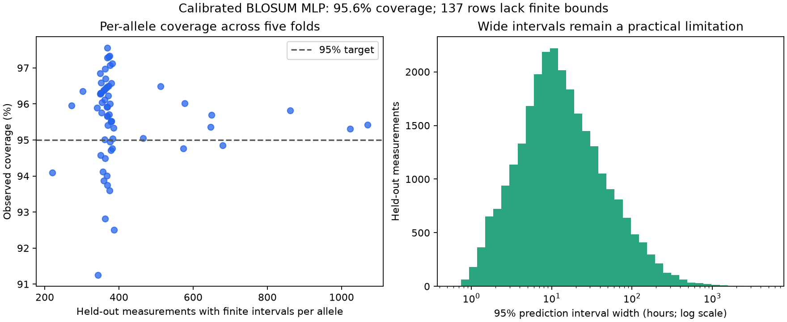

# Calibrated half-life prediction intervals

The separate BLOSUM MLP calibration experiment targets new peptides on already-measured alleles. At a **95% nominal level**, finite intervals covered **95.59%** of **26,894** held-out measurements. Median interval width was **12.00 hours**, and mean width **32.60 hours**. These are prediction intervals for the recorded assay-average label, not confidence intervals for benchmark scores or per-replicate assay variability.

**137 of 27,031 rows (0.51%) have no finite interval** because their allele has insufficient calibration support. They retain [0, infinity) in the CSV for audit purposes and are explicitly unavailable in the demo. They are excluded from the headline finite-interval coverage and widths; their trivial coverage cannot inflate those numbers.

## Method and leakage controls

The original five peptide-group outer folds are preserved. In each outer training portion, 25% of unique peptides are reserved for calibration using seed 1000 + fold. The remaining 75% fit a fresh 256/64 BLOSUM MLP with seed 2000 + fold and the existing grouped inner early-stopping procedure. Fitting, calibration and testing have disjoint peptide sequences across **all** alleles. All five assignments and the design were saved before fitting. Neither calibration nor test labels enter scaling, early stopping or model fitting.

Calibration is **allele-conditional (Mondrian)**: within each allele, every row is a distinct peptide. Use absolute residuals between log1p(recorded hours) and max(0, predicted log value). For n calibration peptides, the threshold is sorted residual number ceil((n+1) × 0.95), using a one-based rank. If the rank exceeds n, the threshold is infinite. This requires at least 19 calibration examples for a finite 95% interval; that minimum is not a claim that 19 provides stable endpoints. There is no pooled fallback for sparse alleles.

For predicted nonnegative log value z and threshold q, bounds in hours are expm1(max(0,z−q)) and expm1(z+q). The same clipping is used during calibration and prediction. Every interval comes from the fitted model used to compute its calibration residuals. Fitted models are never averaged under an unchanged calibration threshold.

## Held-out coverage

| Outer fold | Finite intervals | Coverage | Median width (h) | No finite interval |
|---|---:|---:|---:|---:|
| 0 | 5,430 | 95.87% | 12.18 | 25 |
| 1 | 5,129 | 95.16% | 11.15 | 18 |
| 2 | 5,506 | 95.64% | 12.49 | 21 |
| 3 | 5,469 | 95.12% | 11.20 | 42 |
| 4 | 5,360 | 96.12% | 12.97 | 31 |

Allele-level observed coverage ranges from **91.25% to 97.55%** across 65 supported alleles. These empirical frequencies vary; 95% is not guaranteed for each realized test set, particular peptide, or simultaneous collection of predictions. All 72 alleles are retained in `coverage_by_allele.csv`.

Alleles without finite intervals in any fold: HLA-A*02:05, HLA-A*32:01, HLA-A*68:02, HLA-A*69:01, HLA-B*13:02, HLA-B*35:08, HLA-B*40:02. Their counts and calibration thresholds remain in `calibration.csv` and `unavailable_intervals.csv`.

Distance below means exact positional identity of the test peptide to its nearest **fitting peptide**, not allele identity. All supported alleles already occur in fitting; these results do not validate unseen-allele or locus transfer.

| Nearest fitting peptide identity | Finite intervals | Coverage | Median width (h) |
|---|---:|---:|---:|
| <60% | 23,879 | 95.47% | 11.99 |
| 60–80% | 2,330 | 96.35% | 11.23 |
| 80–100% | 685 | 96.93% | 14.58 |

## Demo behavior

The additional **BLOSUM MLP · calibrated fit** row shows a point prediction, a 95% target interval, and the allele's calibration sample count. Its point prediction differs from the original benchmark MLP because fitting reserves calibration peptides. The five existing benchmark arms keep their original predictions and explicitly uncalibrated fold ranges.

Any peptide already in the dataset routes to the model whose outer fold held out that peptide, even when the requested allele pairing is new. A completely new peptide uses prespecified fold 0. Neither route uses the query peptide in fitting or calibration. The UI shows observed fold coverage and the allele's observed coverage across folds, with their denominators. Sparse alleles display insufficient calibration data, not a misleading finite range.

## Interpretation and limitations

The allele-conditional coverage argument assumes exchangeable calibration and future peptide observations within each allele, conditional on the fitting data. Grouping prevents exact shared-peptide leakage; it does not prove this biological dataset meets exchangeability. Related sequences, binder selection and distribution shifts can violate it. There is no simultaneous coverage guarantee across alleles, and no probability of correctness is assigned to a specific peptide. Log-scale residual cutoffs are constant within an allele/fold; interval width is not a fully learned measure of individual difficulty.

This is a retrospective calibration addition on a dataset already inspected in earlier benchmark work. Test labels were not used to choose the interval method or cutoff, but this is not a new independent confirmatory dataset. Fold training sets overlap, so we do not present binomial row-level confidence intervals as if all validation rows were independent. The finite intervals are often broad; good coverage alone does not establish useful precision. Reported zeros remain exact despite possible censoring. No per-replicate variance or clinical guarantee is available.

Reproduce with `python -m src.conformal` then `python -m src.conformal_report`. Existing matching calibration models resume; fresh clones refit five CPU models without ESM-2 extraction. All results and calibration residuals are under `results/conformal/`; binary models are under the ignored `results/models/conformal/` directory.

References: [split conformal regression](https://arxiv.org/abs/1604.04173), [allele-category analogue: Mondrian calibration](https://mapie.readthedocs.io/en/latest/generated/conditional_cp/2-advanced-analysis/plot_main-tutorial-mondrian-regression/), [limits under distribution shift](https://arxiv.org/abs/2202.13415).
